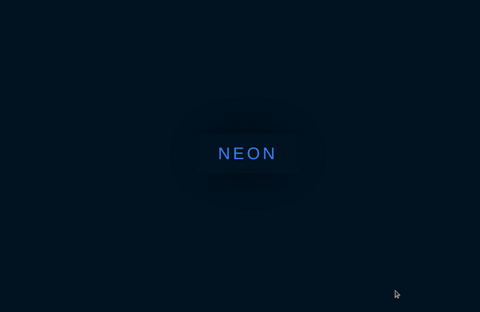

# Neon Button

:warning:	Neon effect using **box-shadow** having bugs when the size of **blur-radius** getting **too big**. Similarly bugs reported here:
- https://stackoverflow.com/questions/32113389/chrome-box-shadow-bugs
- https://github.com/Dogfalo/materialize/issues/4580


<figure>

<figcaption align="center">Works well on small size</figcaption>
</figure>

<figure>

<figcaption align="center">Effect broken when size getting large</figcaption>
</figure>

## Checkout
- You can try changing the size to see the bug I mentioned above by adjusting the __$size__ variable at _./css/style.scss, line 7_
```scss
$size:             12px;
```
to
```scss
$size:             25px;
```

