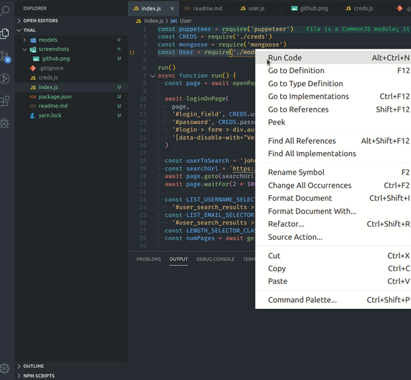

# Thal

Learn puppeteer from [this article](https://medium.com/@e_mad_ehsan/getting-started-with-puppeteer-and-chrome-headless-for-web-scrapping-6bf5979dee3e)


```
git clone ...
npm install # or yarn | or yarn install
node index.js
```




